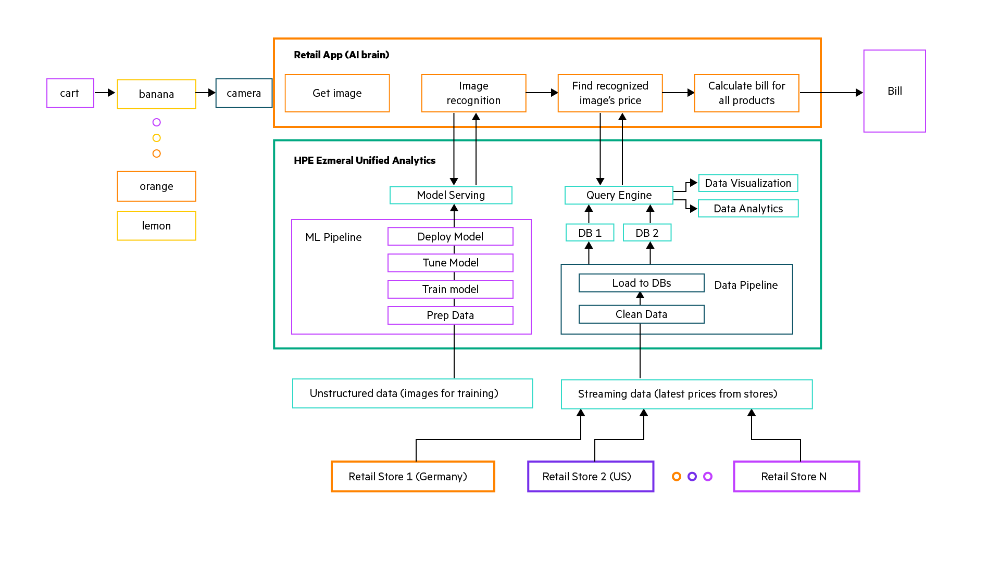

## Smart Data Analyst 

Lorem ipsum dolor sit amet, consectetur adipiscing elit. Sed do eiusmod tempor incididunt ut labore et dolore magna aliqua. Ut enim ad minim veniam, quis nostrud exercitation ullamco laboris nisi ut aliquip ex ea commodo consequat. Duis aute irure dolor in reprehenderit in voluptate velit esse cillum dolore eu fugiat nulla pariatur. Excepteur sint occaecat cupidatat non proident, sunt in culpa qui officia deserunt mollit anim id est laborum.

1. [What You'll Need](#what-youll-need)
1. [Procedure](#procedure)
1. [Functional Architecture](#functional-architecture)
1. [Clean Up](#clean-up)

## What You'll Need

For this tutorial, ensure you have:

- Access to an **HPE Ezmeral Unified Analytics** cluster.

## Procedure

To complete this tutorial follow the steps below:

1. Login to your Unified Analytics cluster using your credentials.
1. In the left sidebar menu of the Unified Analytics dashboard, click
   `Notebooks`.
1. Click `New Notebook Server`.
1. Name the notebook `smart-retail`. Under the `Custom Notebook` dropdown,
   click the `Image` dropdown. Select the notebook image containing
   `jupyter-data-science`. Request at least 4 vCPU and 8Gi of memory for the
   Notebook server.
1. Wait for the notebook server to start. When it is ready, click `Connect`.
   JupyterLab will open in a new tab. 
1. Launch a new Terminal window, and clone the repository locally:
   ```bash
   git clone https://github.com/HPEEzmeral/ezua-tutorials.git --depth 1
   ```
1. Navigate to the tutorial's directory (`ezua-tutorials/demos/smart-retail`).
1. Launch the `00.introduction.ipynb` notebook file.
1. Run the remaining notebook exercises `01` through `07`.

## Functional Architecture




## Clean Up

To clean up the resources used during this experiment, follow the steps below:

- Deleting Endpoints
    1. Navigate to the `Tools and Frameworks` page in your Unified Analytics
       cluster and open `Kubeflow`.
    1. In the left toolbar, click `Endpoints`.
    1. Delete the `retail-experiment` isvc that was launched in Exercize 6.

- Remove Hive Metastore
    1. Navigate to the `Tools and Frameworks` page in your Unified Analytics
       cluster and open `Kubeflow`.
    1. In the left toolbar, click `Endpoints`.
    1. Delete the `retail-experiment` isvc that was launched in Exercize 6.

- Remove Application
    1. Navigate to the `Tools and Frameworks` page in your Unified Analytics
       cluster.
    1. Under the `Data Science` tab, click on the three dots in the top-right
       corner of the `Smart Retail Experience` application. 
    1. Click `Delete`.
