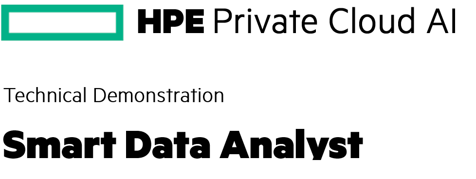

## Smart Data Analyst 

**Welcome to our Smart Retail Data Analyst Demo!**

In this demonstration, we'll harness the power of **Presto**, **Apache Spark** and **Delta Lake** to unlock actionable insights from our retail data. Using advanced analytics, we'll explore customer purchasing patterns, predict sales trends, and optimize inventory management—all powered by real-time SQL queries on our Delta Lake tables.

Retail data holds tremendous potential to drive business growth, from personalized marketing to supply chain optimization. However, the sheer volume and complexity of this data—spanning transactions, customer behavior, and inventory—make it challenging to extract timely insights.

This is where our **smart data analyst** comes in. By combining:
- **Apache Spark**'s distributed compute,
- **Delta Lake**'s reliability for large-scale data,
- **Presto**'s speed for interactive queries,
- **NVIDIA Inference Microservices** (NIM) for AI-powered analysis for natural language questions.

We can transform raw data into strategic decisions. Whether you're asking about seasonal sales trends, product performance, or customer demographics, the system generates precise SQL queries, executes them efficiently, and delivers clear business insights—all in seconds.

Let’s explore how this works!
1. [What You'll Need](#what-youll-need)
1. [Procedure](#procedure)
1. [Functional Architecture](#functional-architecture)
1. [Clean Up](#clean-up)

## What You'll Need

For this tutorial, ensure you have:
- Access to an **HPE Private Cloud AI** environment.

## Procedure

To complete this tutorial follow the steps below:

1. Login to your HPE AI Essentials using your credentials.
1. In the left sidebar menu of the Unified Analytics dashboard, click
   `Notebooks`.
1. Click `New Notebook Server`.
1. Name the notebook `smart-data-analyst`. Under the `Custom Notebook` dropdown,
   click the `Image` dropdown. Select the notebook image containing
   `jupyter-data-science`. Request at least 1 vCPU and 2Gi of memory for the
   Notebook server.
1. Wait for the notebook server to start. When it is ready, click `Connect`.
   JupyterLab will open in a new tab. 
1. Launch a new Terminal window, and clone the repository locally:
   ```bash
   git clone https://github.com/Vincent-Charbonnier/smart-data-analyst.git --depth 1
   ```
1. Navigate to the tutorial's directory (`ezua-tutorials/demos/smart-retail`).
1. Launch the `00.introduction.ipynb` notebook file.
1. Run the remaining notebook exercises `01` through `05`.

## Functional Architecture

Lorem ipsum dolor sit amet, consectetur adipiscing elit. Sed do eiusmod tempor incididunt ut labore et dolore magna aliqua. Ut enim ad minim veniam, quis nostrud exercitation ullamco laboris nisi ut aliquip ex ea commodo consequat. Duis aute irure dolor in reprehenderit in voluptate velit esse cillum dolore eu fugiat nulla pariatur. Excepteur sint occaecat cupidatat non proident, sunt in culpa qui officia deserunt mollit anim id est laborum.


## Clean Up

To clean up the resources used during this experiment, follow the steps below:

Hopefully follow the cleanup notebook

Lorem ipsum dolor sit amet, consectetur adipiscing elit. Sed do eiusmod tempor incididunt ut labore et dolore magna aliqua. Ut enim ad minim veniam, quis nostrud exercitation ullamco laboris nisi ut aliquip ex ea commodo consequat. Duis aute irure dolor in reprehenderit in voluptate velit esse cillum dolore eu fugiat nulla pariatur. Excepteur sint occaecat cupidatat non proident, sunt in culpa qui officia deserunt mollit anim id est laborum.

- Deleting Endpoints
    1. Navigate to the `Tools and Frameworks` page in your Unified Analytics
       cluster and open `Kubeflow`.
    1. In the left toolbar, click `Endpoints`.
    1. Delete the `retail-experiment` isvc that was launched in Exercize 6.

- Remove Hive Metastore
    1. Navigate to the `Tools and Frameworks` page in your Unified Analytics
       cluster and open `Kubeflow`.
    1. In the left toolbar, click `Endpoints`.
    1. Delete the `retail-experiment` isvc that was launched in Exercize 6.
